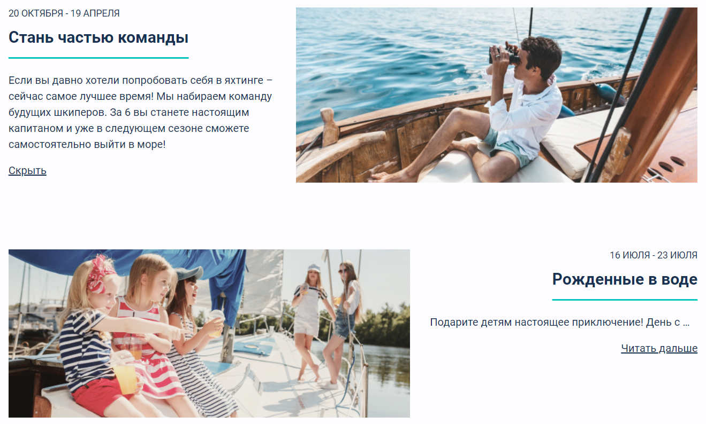

# Yacht-Club
Лендинг яхт-клуба "Под парусом", созданный в рамках курса "Старт в программировании" на HTML Academy. Каждый компонент был реализован в соответствии с макетом и правилами семантической разметки.

При реализации использовались HTML, CSS и JS.

## Превью

## Как использовать
* Запустить проект можно, например, по следующей ссылке: [Яхт-клуб "Под парусом"](https://helluna.github.io/Yacht-Club/).
* Переключить тему и шрифт можно по соответствующим кнопкам в самом верху страницы:

  
  
  

  ---
* Полный текст статьи отображается при нажатии на кнопку `Читать дальше` (для скрытия - кнопка `Скрыть`):

  

  ---
* Карточки в разделе "Аренда яхты" можно отобразаить или в виде плитки, или в виде списка при нажатии на соответствующие кнопки:

  

  ---
* Между картинками в галерее можно переключаться:

  
